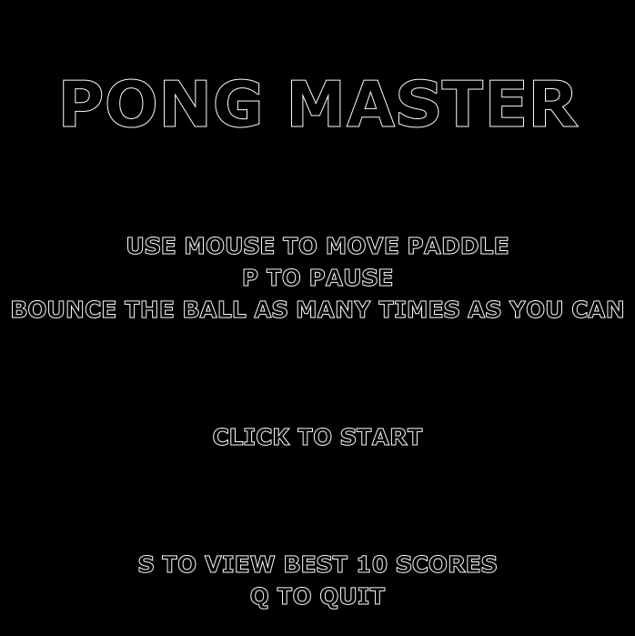
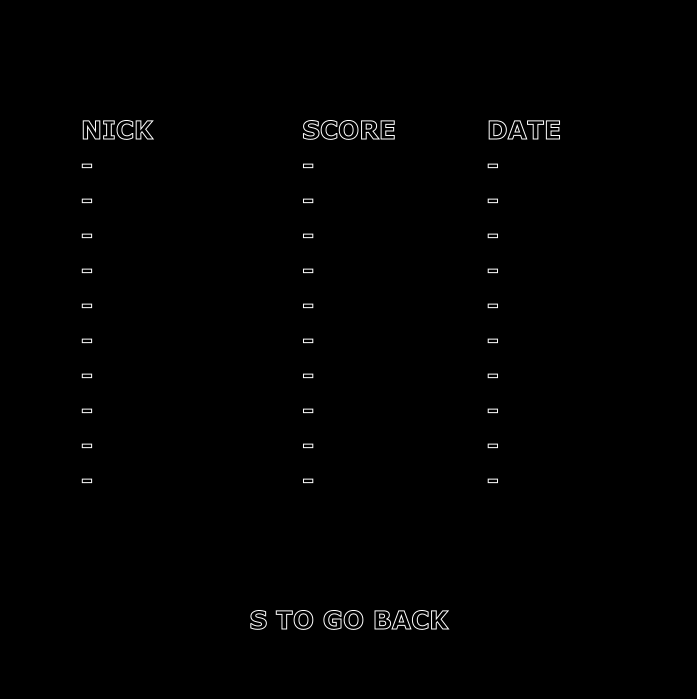

# Pong-Master
It is a simple game made with JavaFx. Your objective is to bounce ball as many time as you can. Ball increases its speed with every point, which you get everytime when ball hit the paddle. Use your mouse to move the paddle. You can also pause game by pressing 'P' key during gameplay. From main menu you can check the best 10 scores, which includes maximum 9 charaters nick, score and date.  
  

It includes following things:
- GUI (JavaFx)  
  Simple GUI that informs about controls and scores.  
    
    
- Task synchronization  
  There is a need to execute task in specific order:  
  I. Check player position  
  II. Check collisions  
  III. Move ball  
- MySQL database (JDBC)  
  Database that store scores.  
- Client-server architecture  
  Client plays game and cannot view and save scores if server is down.  
- Unit tests  
  Tests to quickly check correctness of method.  
